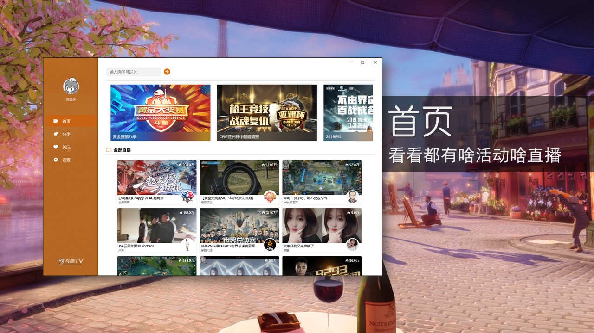
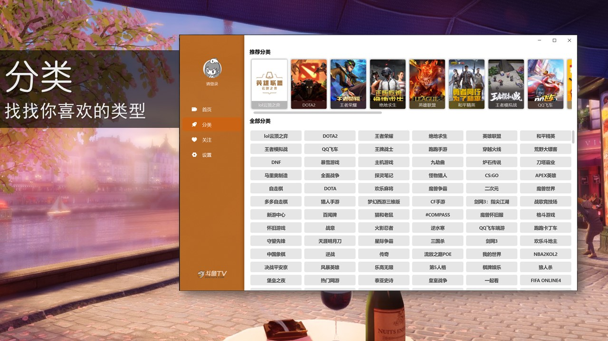
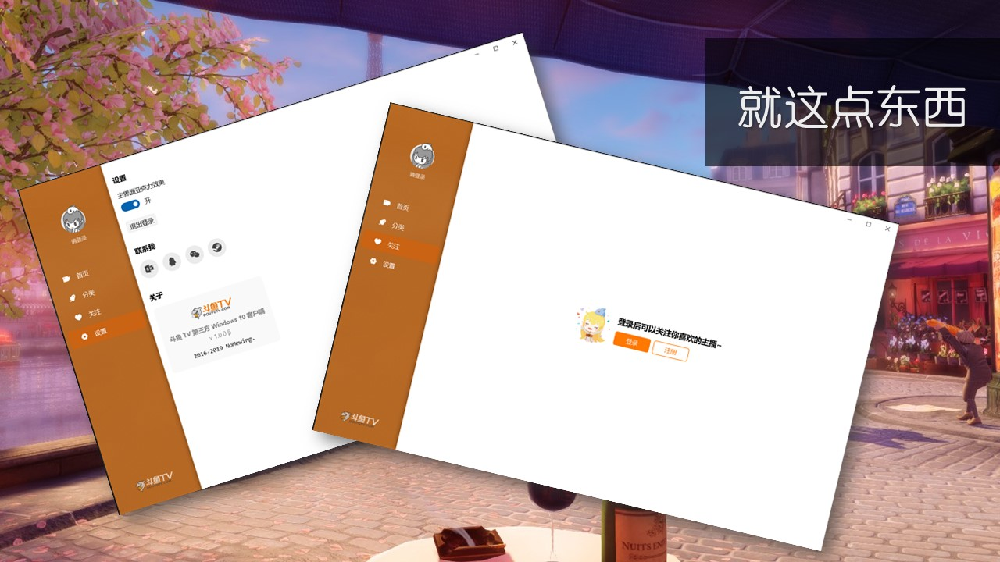

# 看看斗鱼 UWP

唉，本来想整一个第三方的斗鱼 UWP 来着，官方的经常看不到弹幕（看看人家虎牙，虽然界面也不咋好看，但是人家那 UWP 至少稳定够用啊），结果就到网上看大佬们抓包解密啥的，整了半天发现失效了，看有人说斗鱼经常变接口，那段时间我一看，连安卓端著名的 Mix 斗鱼第三方都不行了，只好找官方开发者平台，加了群一个活人没有，成了开发者互助群，官方的人连个 P 都没有，没办法了，先不整了，现在微软商店又上架了个 Win32 的轻量斗鱼还不错。

好歹折腾了一段时间，做成了下面这个样子，主要就差那个 HLS 地址搞不到，能力不足没办法。

